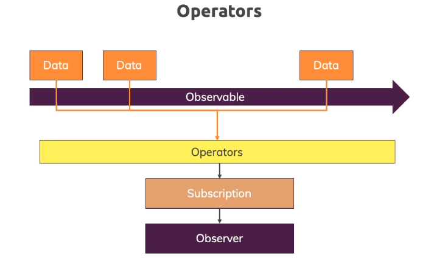

# Angular-Observable-Operator-Snippet.md



## map - Operator

```
import { Component, OnInit, OnDestroy } from '@angular/core';
import { interval, Subscription, Observable } from "rxjs";
import { map } from 'rxjs/operators';

@Component({
  selector: 'app-home',
  templateUrl: './home.component.html',
  styleUrls: ['./home.component.css']
})
export class HomeComponent implements OnInit, OnDestroy {

  private firstObsSubscription: Subscription;
  constructor() { }

  ngOnInit() {
    // this.firstObsSubscription = interval(1000).subscribe(count => {
    //   console.log(count);
    // });

    const customIntervalObservable = Observable.create(observer => {
      let count = 0;
      setInterval(() => {
          observer.next(count);
          if (count == 2) {
            observer.complete();
          }
          if (count > 3) {
            observer.error(new Error('Count is greater than 3'));
          }
          count++;
        }, 1000);
    });

    this.firstObsSubscription = customIntervalObservable.pipe(map( (data: number) => {
      return 'Round: ' + (data +1);
    })).subscribe(data => {
      console.log(data);
    }, error => {
      console.log(error);
      alert(error.message);
    }, () => {
      console.log('Completed!');
    });
  }

  ngOnDestroy(): void {
    this.firstObsSubscription.unsubscribe();
  }
}
```
So this is the map operator and again justice before does is kind of a constructed example here it is of course more useful for example if you're fetching complex data from a web server and you want to transform that data before you use it as a component.
And that is something we'll do later too.

But the core idea is the same with pipe. We can add one or more operators if you have more than one. You simply add them as arguments here to the pipe method. So the pipe method takes an unlimited amount of arguments and each argument would be an operator imported from our exchange operators and you can add as many as you want and they will execute after each other and do different kinds of stuff on the data. This is map of course for example you could also filter that's another operator indeed so let's use

## filter - Operator

```
import { Component, OnInit, OnDestroy } from '@angular/core';
import { interval, Subscription, Observable } from "rxjs";
import { map, filter } from 'rxjs/operators';

@Component({
  selector: 'app-home',
  templateUrl: './home.component.html',
  styleUrls: ['./home.component.css']
})
export class HomeComponent implements OnInit, OnDestroy {

  private firstObsSubscription: Subscription;
  constructor() { }

  ngOnInit() {
    // this.firstObsSubscription = interval(1000).subscribe(count => {
    //   console.log(count);
    // });

    const customIntervalObservable = Observable.create(observer => {
      let count = 0;
      setInterval(() => {
          observer.next(count);
          if (count == 2) {
            observer.complete();
          }
          if (count > 3) {
            observer.error(new Error('Count is greater than 3'));
          }
          count++;
        }, 1000);
    });

    

    this.firstObsSubscription = customIntervalObservable.pipe(filter(data => {
      return data > 0;
    }), map( (data: number) => {
      return 'Round: ' + (data +1);
    })).subscribe(data => {
      console.log(data);
    }, error => {
      console.log(error);
      alert(error.message);
    }, () => {
      console.log('Completed!');
    });
  }

  ngOnDestroy(): void {
    this.firstObsSubscription.unsubscribe();
  }
}
```
But back to our code now let's dive into filter and if we wanted to add that to we would simply add it here separated by a comma in front of map as an extra argument here and filter all that gets the date of course and instead of that anonymous function which we pass and filter where we do get that data we now have to return true or false which decides whether that data point will continue in that chain.

So whether it will reach map and they're often subscription or whether it will be dropped in which case it will never reach map nor does subscription. Now of course we could hard code True or false here but that's not too useful. Instead we could say yeah return true if data is greater than zero. And that effectively means that we will return every value but the very first one and they are for us  since we bridge round data plus 1 will not start with Round 1 because we're dropping this zero value.

Instead we'll actually start with round two because only then this condition is true so if we now go back to our application here let this reload. We see nothing but then round Q round free and zones around one indeed is skipped and that shows you hopefully the power of operators that they allow you to build up a chain of steps you want to funnel your observable data through that can be really helpful when it comes to transforming data filtering  out data and so on.
### END 
