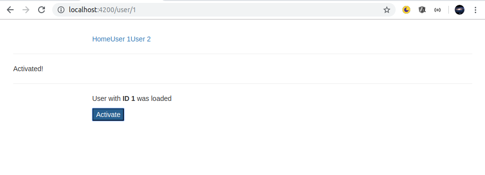
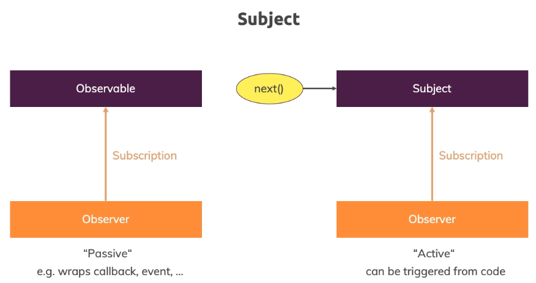

# Angular-Subject

### Event Emitter Approach ( Example: To show Activate Message by clicking Activate Button )


```
#user.service.ts
#---
import { EventEmitter, Injectable } from '@angular/core';

@Injectable({providedIn: 'root'})
export class UserService {
    activatedEmitter = new EventEmitter<boolean>();
 }
#---

#app.component.ts
#---
import { Component, OnInit } from '@angular/core';
import { UserService } from './user.service';

@Component({
  selector: 'app-root',
  templateUrl: './app.component.html',
  styleUrls: ['./app.component.css']
})
export class AppComponent implements OnInit {
  userActivated = false;

  constructor(private userService: UserService) {}

  ngOnInit() {
    this.userService.activatedEmitter.subscribe(didActivate => {
      this.userActivated = didActivate;
    });
  }
}
#---

#user.component.html
#---
<p>User with <strong>ID {{ id }}</strong> was loaded</p>
<button class="btn-primary" (click)="onActivate()">Activate</button>
#---

#user.component.ts
#---
import { Component, OnInit } from '@angular/core';
import { ActivatedRoute, Params } from '@angular/router';
import { UserService } from '../user.service';

@Component({
  selector: 'app-user',
  templateUrl: './user.component.html',
  styleUrls: ['./user.component.css']
})
export class UserComponent implements OnInit {
  id: number;

  constructor(private route: ActivatedRoute, 
              private userService: UserService) { }

  ngOnInit() {
    this.route.params
      .subscribe(
        (params: Params) => {
          this.id = +params['id'];
        }
      );
  }

  onActivate() {
    this.userService.activatedEmitter.emit(true);
  }
}
#---
```

Above shown is a old approach with the event emitter and this is an approach you could use but there is a better one a more recommended one and that new approach to better approach (Below shown) uses a subject now a subject is something we import from artist to yes. 

So you import subject from artist asks J.S. instead of Vandermeer you now create a subject here other than that it's pretty similar though it's a generic type where you define which data will eventually  be emitted in this case a boolean. So it's very similar to Vandermeer thus far. We also use it very similarly in the user component we don't call it mid however but something you saw before already.

You call next because a subject is a special kind of observable.You could say we know observable as you can subscribe to them as you learned but they're rather passive. You'll learn how to create your own observable but the core idea always is that you wrap a callback or an event or something like that a subject is different a subject although is an object you can subscribe to but it's more active because you can actively call next on it from outside.

```
#user.service.ts
#---
import { Injectable } from '@angular/core';
import { Subject } from 'rxjs';

@Injectable({providedIn: 'root'})
export class UserService {
    activatedEmitter = new Subject<boolean>();
 }
#---

#user.component.ts
#---
import { Component, OnInit } from '@angular/core';
import { ActivatedRoute, Params } from '@angular/router';
import { UserService } from '../user.service';

@Component({
  selector: 'app-user',
  templateUrl: './user.component.html',
  styleUrls: ['./user.component.css']
})
export class UserComponent implements OnInit {
  id: number;

  constructor(private route: ActivatedRoute, 
              private userService: UserService) { }

  ngOnInit() {
    this.route.params
      .subscribe(
        (params: Params) => {
          this.id = +params['id'];
        }
      );
  }

  onActivate() {
    this.userService.activatedEmitter.next(true);
  }
}
#---
```
Remember in the observable we all called next. But that was from inside the observable when we created it. So that is a more active observable that is perfect. When you want to use it as an event emitter. So if we don't have a passive event source like an HBP request or dorm events but if we have something that actively needs to be triggered by us and our application and that's exactly the use case we have here we now can call next year and the user service on our activated emitter the activated emitter is that subject and then the app component.



We still call it subscribe because it is isn't observable and therefore we can subscribe if it now safe that you click activate again. It still works but now it's a subject and what's a technically of course works in a similar way <b>using a subject is recommended way don't use event emitter use subjects they are in the end a bit more efficient behind the scenes </b>.

You can also now use all these cool operators because a subject at the end all that is kind of an observable. So you have depth too which is a huge advantage and it's simply something you can should keep in mind. Use subjects instead of observable. 

One important note just as with your own observe volts. You should unsubscribe to your subjects though whenever you don't need them. So add on destroy here to the app component which you need to import or to any other component where you set up a subscription to your subject stored as subscription activated. Sub is a subscription subscription needs to be imported from our exchanges J.S. so make sure to add that import in your file as well. Stored and subscription then so here where you call subscribe you simply set this equal to activate  it's up so that your subscription is stored here and then you add energy on destroy and inside of NGO on destroy you simply use your subscription and call unsubscribe and now you have a great application without any memory leaks or anything like that.
```
#app.component.ts
#---
import { Component, OnInit, OnDestroy } from '@angular/core';
import { Subscription } from 'rxjs';
import { UserService } from './user.service';

@Component({
  selector: 'app-root',
  templateUrl: './app.component.html',
  styleUrls: ['./app.component.css']
})
export class AppComponent implements OnInit, OnDestroy {
  userActivated = false;
  private activatedSub: Subscription;

  constructor(private userService: UserService) {}

  ngOnInit() {
    this.activatedSub = this.userService.activatedEmitter.subscribe(didActivate => {
      this.userActivated = didActivate;
    });
  }

  ngOnDestroy(): void {
    this.activatedSub.unsubscribe();
  }
}
#---
```
Now one important note about subjects as a replacement for event emitters. This only counts if you're using them as cross component event emitters where you manually call next or previously emit. You don't use subjects instead of event emitter.
When you're using at output. <b>So if you're using in a component if you're using @Output here with your own event you still use the angular event emitter</b>.
 
You're not using subject there because the subject is not suitable for that. There you need the angular even emitter. You only use subjects to communicate across components through services so through a mechanism where you in the end subscribe to somewhere like here in the app component. If you're not subscribing to any Vandermeer then it probably is an output. If you do plan to subscribe manually then it is a subject.

### END
