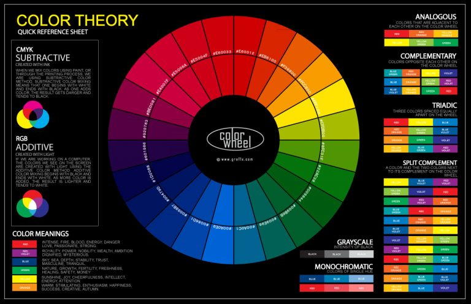

# My Mean Stack

## Course content [Total 148 lectures] [Total Time Neeeded 12:39:03]

+ <b>Getting Started - 11 lectures 39:31</b>|
  - Introduction
    Preview
    01:57|
    
  - What is MEAN?
    Preview
    10:35
  - What is a Single Page Application (SPA)?
    Preview
    02:08
  - How Does the MEAN Stack Work?
    Preview
    02:58
  - MUST READ: Angular CLI - Latest Version
    00:18
  - Installing Node & the Angular CLI
    Preview
    07:50
  - Installing our IDE
    Preview
    03:13
  - Exploring the Project Structure
    Preview
    04:02
  - Course Outline
    Preview
    03:27
  - How To Get The Most Out Of This Course
    Preview
    02:53
  - Section Resources
    00:10

+ <b>The Angular Frontend - Understanding the Basics 19 lectures 01:53:52</b>
  - Module Introduction
    01:40
  - Understanding the Folder Structure
    06:40
  - Understanding Angular Components
    02:39
  - Adding our First Component
    08:01
  - Listening to Events
    03:43
  - Outputting Content
    05:34
  - Getting User Input
    06:03
  - Installing Angular Material
    12:16
  - Adding a Toolbar
    03:57
  - Outputting Posts
    06:37
  - Diving Into Structural Directives
    05:40
  - Creating Posts with Property & Event Binding
    07:38
  - Creating a Post Model
    04:35
  - Adding Forms
    08:18
  - Getting Posts from Post-Create to Post-List
    09:26
  - Calling GET Post
    11:16
  - More About Observables
    05:51
  - Working on our Form
    03:51
  - Section Resources
    00:07
+ <b>Adding NodeJS to our Project -  12 lectures 01:03:29</b>
  - Module Introduction
    02:03
  - Connecting Node & Angular - Theory
    04:37
  - What is a RESTful API?
    04:45
  - Adding the Node Backend
    08:20
  - Adding the Express Framework
    07:37
  - Improving the server.js Code
    04:40
  - Fetching Initial Posts
    05:57
  - Using the Angular HTTP Client
    09:20
  - Understanding CORS
    05:31
  - Adding the POST Backend Point
    05:27
  - Adding Angular
    05:07
  - Section Resources
    00:05
+ <b>Working with MongoDB  - 17 lectures 01:05:24</b>
  - Module Introduction
    01:04
  - What is MongoDB?
    01:48
  - Comparing SQL & NoSQL
    04:26
  - Connecting Angular to a Database
    02:07
  - Setting Up MongoDB
    05:14
  - Using MongoDB Atlas & IP Whitelist
    00:19
  - Adding Mongoose
    03:01
  - Understanding Mongoose Schemas & Models
    05:45
  - Creating a POST Instance
    04:08
  - Connecting our Node Express App to MongoDB
    03:10
  - Storing Data in a Database
    05:51
  - Fetching Data From a Database
    05:34
  - Transforming Response Data
    05:07
  - Deleting Documents
    07:37
  - Updating the Frontend after Deleting Posts
    03:02
  - Adding Posts with an ID
    07:07
  - Section Resources
    00:03
+ <b>Enhancing the App  - 11 lectures 01:04:23</b>
  - Module Introduction
    01:11
  - Adding Routing
    10:12
  - Styling Links
    03:59
  - Client Side vs Server Side Routing
    02:44
  - Possible Error
    00:09
  - Creating the "edit" Form
    10:38
  - Finishing the Edit Feature
    11:09
  - Updating Posts on the Server
    09:21
  - Re-Organizing Backend Routes
    05:54
  - Adding Loading Spinners
    09:05
  - Section Resources
    00:01
+ <b>Adding Image Uploads to our App  - 15 lectures 01:29:10</b>
  - Module Introduction
    00:44
  - Adding the File Input Button
    04:51
  - Converting the Form from a Template Driven to a Reactive Approach
    13:41
  - Adding Image Controls to Store the Image
    06:59
  - Adding an Image Preview
    04:58
  - Starting with the Mime-Type Validator
    08:20
  - Finishing the Image Validator
    07:17
  - Adding Server Side Upload
    08:23
  - Uploading Files
    06:05
  - Working with the File URL
    06:18
  - Beware of the Spread (...) Operator
    00:40
  - Fetching Images on the Frontend
    06:37
  - Updating Posts with Images
    13:20
  - Wrap Up
    00:54
  - Section Resources
    00:03
+ <b>Adding Pagination -  7 lectures 32:54</b>
  - Module Introduction
    01:04
  - Adding the Pagination Component
    07:18
  - Working on the Pagination Backend
    08:08
  - Connecting the Angular Paginator to the Backend
    05:24
  - Fetching Posts Correctly
    06:09
  - Finishing Touches
    04:48
  - Section Resources
    00:03
+ <b>Adding User Authentication  - 20 lectures 02:09:02</b>
  - Module Introduction
    00:59
  - Adding the Login Input Fields
    08:15
  - Handling User Input
    03:42
  - Adding the Signup Screen
    03:32
  - Creating the User Model
    06:23
  - Creating a New User Upon Request
    05:30
  - Connecting Angular to the Backend
    06:38
  - Understanding SPA Authentication
    03:39
  - Implementing SPA Authentication
    09:32
  - Sending the Token to the Frontend
    05:43
  - Adding Middleware to Protect Routes
    11:47
  - Adding the Token to Authenticate Requests
    13:45
  - Improving the UI Header to Reflect the Authentication Status
    07:23
  - Improving the UI Messages to Reflect the Authentication Status
    06:19
  - Connecting the Logout Button to the Authentication Status
    02:32
  - Redirecting Users
    04:25
  - Adding Route Guards
    06:48
  - Reflecting the Token Expiration in the UI
    06:12
  - Saving the Token in the Local Storage
    15:54
  - Section Resources
    00:04
+ <b>Authorization -  7 lectures 32:36</b>
  - Module Introduction
    01:09
  - Adding a Reference to the Model
    03:28
  - Adding the User ID to Posts
    07:02
  - Protecting Resources with Authorization
    08:19
  - Passing the User ID to the Frontend
    07:24
  - Using the User ID on the Frontend
    05:11
  - Section Resources
    00:03
+ <b>Handling Errors -  8 lectures 39:57</b>
  - Module Introduction
    01:14
  - Testing Different Places to Handle Errors
    09:49
  - The Error Interceptor
    08:01
  - Displaying the Basic Error Dialog
    05:13
  - Adding an Error Dialog
    05:26
  - Returning Error Messages on the Server
    07:10
  - Finishing Touches
    03:03
  - Section Resources
    00:01
+ <b>Optimizations  - 12 lectures 48:22 </b>
  - Module Introduction
    00:34
  - Using Controllers
    08:16
  - Separating the Middleware
    03:30
  - Creating an Angular Material Module
    04:20
  - Splitting the App Into Feature Modules
    05:14
  - Fixing an Update Bug
    02:31
  - Creating the Auth Module
    04:08
  - Adding Lazy Loading
    07:58
  - Fixing the AuthGuard
    00:04
  - Using a Global Angular Config
    06:18
  - Using Node Environment Variables
    05:26
  - Section Resources
    00:03
+ <b>Deploying our App  - 7 lectures 38:10</b>
  - Module Introduction
    00:40
  - Deployment Options
    03:59
  - Deploying the REST Api
    13:34
  - Deploying Angular
    00:27
  - Angular Deployment - Finishing the Two App Setup
    09:51
  - Using the Integrated Approach
    09:37
  - Section Resources
    00:01
+ <b>Course Roundup  - 2 lectures 02:31 Requirements</b>
  - Course Roundup
    02:05
  - Bonus: More Content!
    00:26

### Reference Additional Material
- [Learn everything about Angular](https://academind.com/learn/angular)
- [Angular Material Tutorial](https://academind.com/learn/angular/angular-material-a-thorough-guide/)
- [Angular Material Docs](https://material.angular.io/)
- [Reference vs Primitive Types in JS](https://academind.com/learn/javascript/reference-vs-primitive-values/)
- [RxJS Tutorial](https://academind.com/learn/javascript/understanding-rxjs/)

