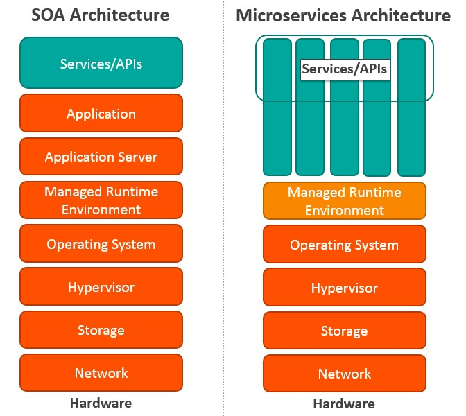
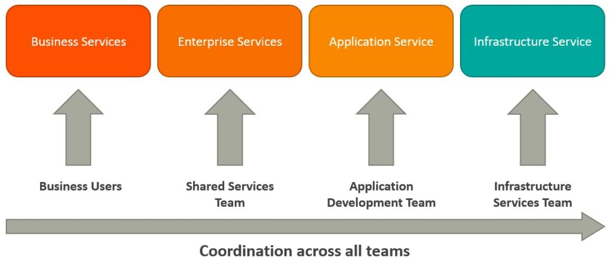
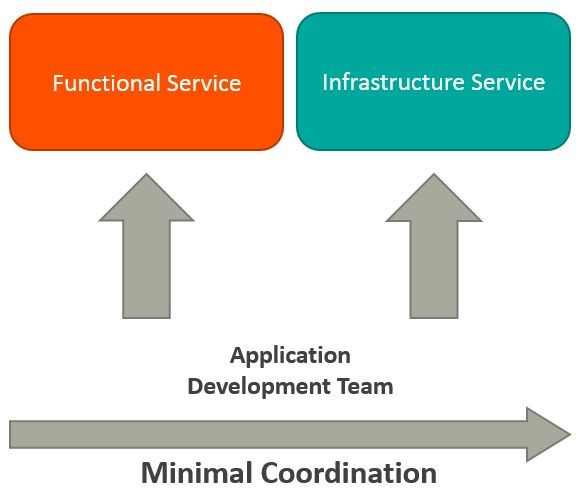
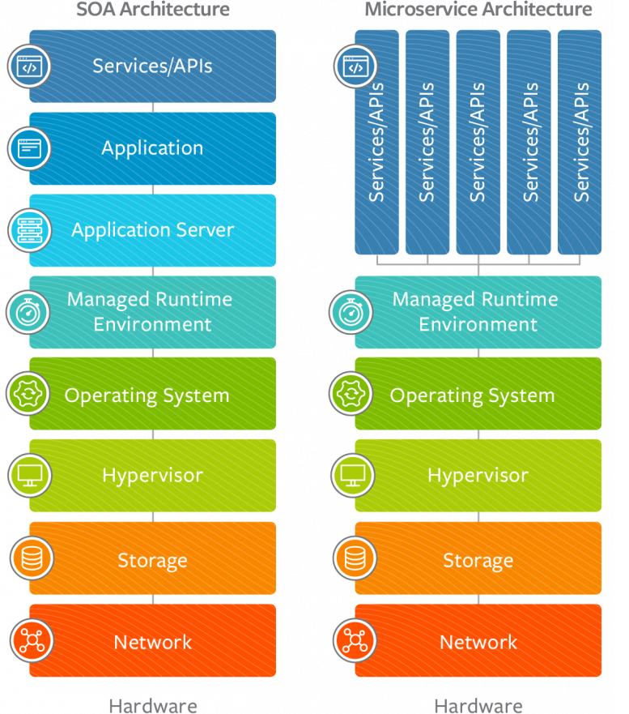

# SOA Vs MSA Architecture
Microservices Architecture (MSA) and Service-Oriented Architecture (SOA) both rely on services as the main component. But they vary greatly in terms of service characteristics.
[Youtube-Ref](https://www.youtube.com/watch?v=YTdTKsm9n14)

### SOA defines four basic service types as depicted below:
1. Business services are coarse-grained services that define core business operations. They are usually represented through XML, Web Services Definition Language (WSDL), or Business Process Execution Language (BPEL).
2. Enterprise services implement the functionality defined by business services. They rely on application services and infrastructure services to fulfill business requests.
3. Application services are fine-grained services that are bound to a specific application context. These services can be invoked directly through a dedicated user interface.
4. Infrastructure services implement non-functional tasks such as authentication, auditing, security, and logging. They can be invoked from either application services or enterprise services.

MSAs have limited service taxonomy. The architecture consists of two service types as depicted below.
1. Functional services support specific business operations. The services are accessed externally and they are usually not shared with any other service. As in SOA, infrastructure services implement tasks such as auditing, security, and logging. The services are not exposed to the outside world and they are available internally.

Key Differences Between SOA and MSA

SOA	MSA
Built on the idea of a “share-as-much-as-possible” architecture approach	Built on the idea of “share-as-little-as-possible” architecture approach
More importance on business functionality reuse	More importance on the concept of “bounded context”
Common governance and standards	Relaxed governance, with more focus on people collaboration and freedom of choice
Uses enterprise service bus (ESB) for communication	Uses less elaborate and simple messaging system
Supports multiple message protocols	Uses lightweight protocols such as HTTP/REST & AMQP
Common platform for all services deployed to it	Application Servers not really used. Platforms such as Node.JS could be used
Multi-threaded with more overheads to handle I/O	Single-threaded usually with use of Event Loop features for non-locking I/O handling
Use of containers (Dockers, Linux Containers) less popular	Containers work very well in MSA
Maximizes application service reusability	More focused on decoupling
Uses traditional relational databases more often	Uses modern, non-relational databases
A systematic change requires modifying the monolith	A systematic change is to create a new service
DevOps / Continuous Delivery is becoming popular, but not yet mainstream	Strong focus on DevOps / Continuous Delivery
Let’s Explore the Differences in More Detail:
Coordination: In SOA, you need to coordinate with multiple groups to create business requests. But there is little or no coordination among services in MSA. If coordination is needed among service owners, it is done through small application development teams, and services can be quickly developed, tested, and deployed.
Service granularity: The prefix “micro” in Microservices refers to the granularity of the internal components. Service components within MSA are generally single purpose services that do one thing really well. Services usually include much more business functionality in SOA, and they are often implemented as complete subsystems.
Component sharing: SOA enhances component sharing, whereas MSA tries to minimize on sharing through “bounded context.” A bounded context refers to the coupling of a component and its data as a single unit with minimal dependencies. As SOA relies on multiple services to fulfill a business request, systems built on SOA are likely to be slower than MSA.
Middleware vs API layer: The messaging middleware in SOA offers a host of additional capabilities not found in MSA, including mediation and routing, message enhancement, message and protocol transformation. MSA has an API layer between services and service consumers.
Remote services: SOA architectures rely on messaging (AMQP, MSMQ) and SOAP as primary remote access protocols. Most MSAs rely on two protocols – REST and simple messaging (JMS, MSMQ), and the protocol found in MSA is usually homogeneous.
Heterogeneous interoperability: SOA promotes the propagation of multiple heterogeneous protocols through its messaging middleware component. MSA attempts to simplify the architecture pattern by reducing the number of choices for integration. If you would like to integrate several systems using different protocols in heterogeneous environment, you need to consider SOA. If all your services could be exposed and accessed through the same remote access protocol, then MSA is a better option.
Contract decoupling: Contract decoupling is the holy grail of abstraction. It offers the greatest degree of decoupling between services and consumers. It is one of the fundamental capabilities offered within SOA. But MSA doesn’t support contract decoupling.
Microservices are not invented. Enterprises such as Amazon, Netflix, and eBay used the divide and conquer strategy to functionally partition their monolithic applications into smaller units, and resolved many issues. Following the success of these companies, many other companies started adopting this as a common pattern to refactor their applications. Eventually the pattern was termed as Microservices Architecture. Nothing radically new has been introduced in MSA. MSA is the logical evolution of SOA and supports modern business use cases.

Which is Better for Our Business?
SOA is better suited for large and complex business application environments that require integration with many heterogeneous applications. However, workflow-based applications that have a well-defined processing flow are a bit difficult to implement using SOA patterns. Small applications are also not a good fit for SOA as they don’t need a messaging middleware component. The MSA pattern is well suited for smaller and well partitioned web-based systems. The lack of messaging middleware is one of the factors that makes it unfit for complex environments.

If you are developing an application, then MSA gives you greater control as a developer. If you are trying to orchestrate a number of business processes, SOA probably provides a better set of tools.

Also, in the early stages of your business, you might find that MSA is a good choice. As the business grows, you may need capabilities such as complex request transformation and heterogeneous systems integration. In such situations, you are likely to turn to SOA pattern to replace MSA.

Both SOA and MSA are the same set of standards used at different layers of an enterprise. The existence of MSA comes down to the success of SOA pattern. Hence, MSA pattern is a subset of SOA. Here the main focus is on the runtime autonomy of each service.

